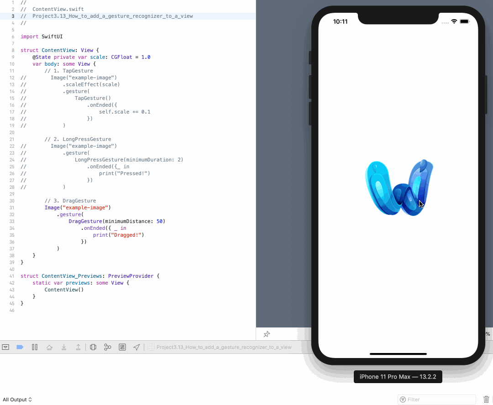

<!-- more -->
### 1. 简介
我们可以给任何 SwiftUI  视图附加手势识别器，而这些手势识别器又可以附加闭包，这些闭包将在识别器被激活时运行。

### 2. 示例
有几个手势识别器可供使用，这里将提供其中几个手势识别器的代码示例，以帮助入门 - 我们将看到它们有多相似。
#### 2.1 `TapGesture` 点击手势
创建 TapGesture 时，我们可以指定触发手势所需的点击次数，然后附加一个 `onEnded` 闭包，该闭包将在手势发生时运行。

例如，我们来创建一个每次点击时都会变大的图像:
```swift
struct ContentView: View {
    @State private var scale: CGFloat = 1.0
    var body: some View {
        Image("example-image")
            .scaleEffect(scale)
            .gesture(
                TapGesture()
                    .onEnded({
                        self.scale += 0.1
                    })
            )
    }
}
```
效果预览:


#### 2.2 `LongPressGesture` 长按手势
LongPressGesture 可识别用户何时按下视图并保持至少一段用户指定的时间。 
因此，我们创建一个图像视图，在按下该消息至少两秒时打印该消息:
```swift
struct ContentView: View {

    var body: some View {
        Image("example-image")
            .gesture(
                LongPressGesture(minimumDuration: 2)
                    .onEnded({ _ in
                        print("Pressed!")
                    })
            )
    }
}
```
效果预览:


#### 2.3 `DragGesture` 拖拽手势
最后，当用户按下视图并移动至少一定距离时，DragGesture 会触发。因此，我们创建一个带有拖动手势的图像，当它们移动至少50个点时会触发:
```swift
struct ContentView: View {
 
    var body: some View {
        Image("example-image")
            .gesture(
                DragGesture(minimumDistance: 50)
                    .onEnded({ _ in
                        print("Dragged!")
                    })
            )
    }
}
```
效果预览
