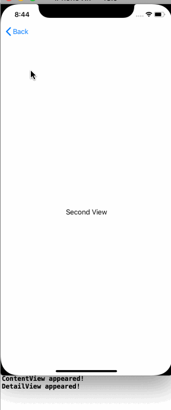

<!-- more -->
### 1. 简介
SwiftUI 以 `onAppear()` 和 `onDisappear()` 的形式为我们提供了 UIKit 的`viewDidAppear()` 和 `viewDidDisappear()` 的等价物。 您可以将任何代码附加到您想要的这两个事件，SwiftUI 将在它们发生时执行它们。

### 2. 示例
注意：在当前的beta版本， onAppear() 工作得很好，但 onDisappear() 似乎没有被调用。
例如: 我们创建两个使用 onAppear() 和 onDisappear() 来打印消息的视图，并使用导航按钮在两者之间移动：
```swift
struct ContentView : View {
    var body: some View {
        NavigationView {
            NavigationLink(destination: DetailView()) {
                Text("Hello World")
            }
        }.onAppear {
            print("ContentView appeared!")
        }.onDisappear {
            print("ContentView disappeared!")
        }
    }
}

struct DetailView : View {
    var body: some View {
        VStack {
            Text("Second View")
        }.onAppear {
            print("DetailView appeared!")
        }.onDisappear {
            print("DetailView disappeared!")
        }
    }
}
```
运行效果:

当代码运行时，我们应该能够在两个视图之间移动，并看到 Xcode 调试控制台中打印的消息。