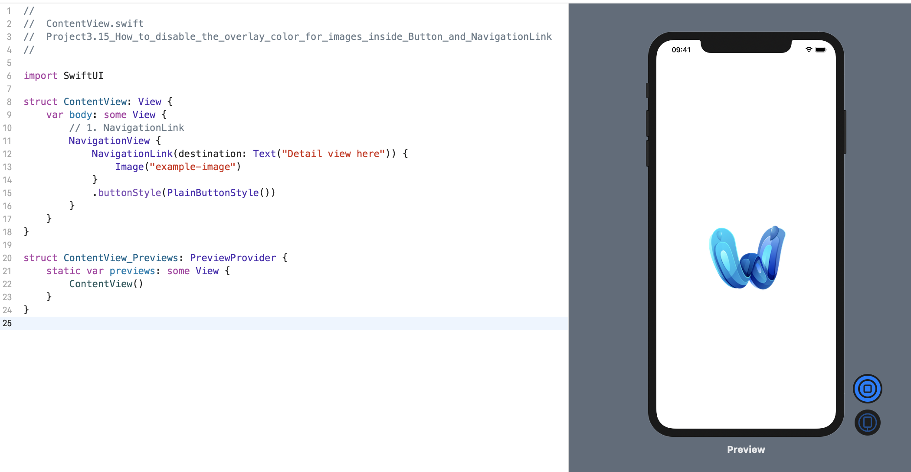
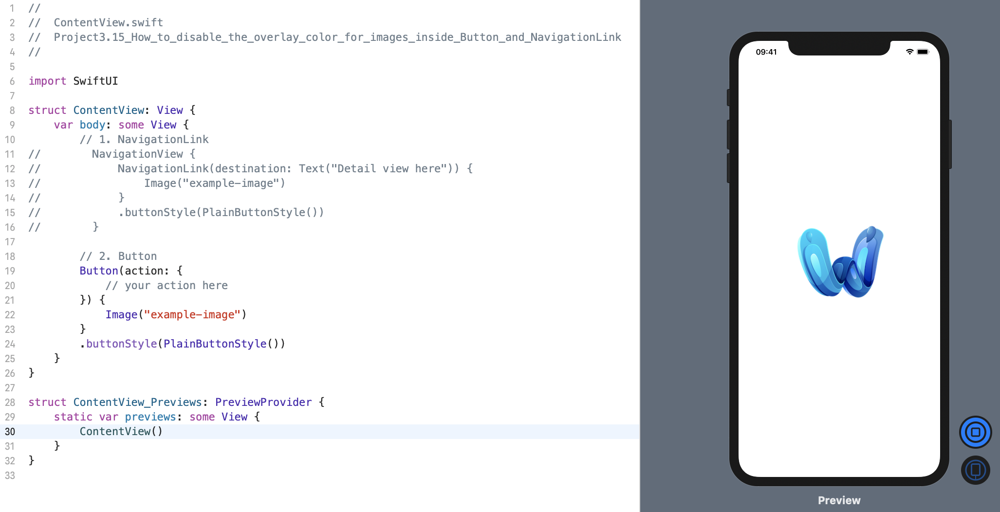
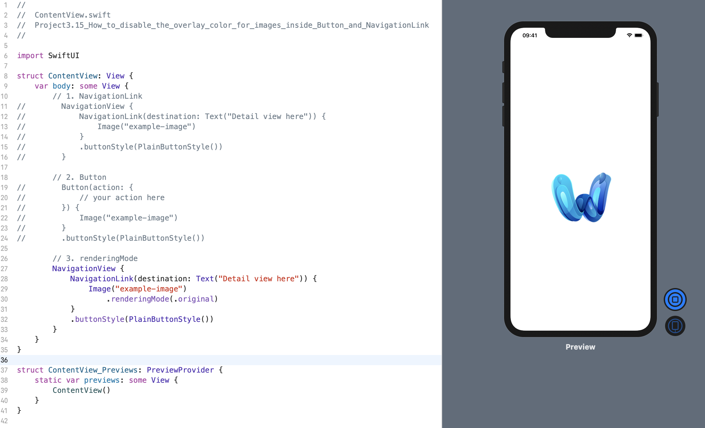

默认情况下，在 `NavigationLink` 或 `Button` 内部绘制的图像几乎不会表现出预期的效果: 整个图像将被不透明的蓝色或视图中带有任何强调色的颜色覆盖。

有两种方法可以解决这个问题；选择哪种方法取决于我们想要的行为(behavior)。

首先，可以将 `buttonStyle()` 修饰符与 `PlainButtonStyle()`一起使用，如下所示:
```swift
struct ContentView: View {
    var body: some View {
        // 1. NavigationLink
        NavigationView {
            NavigationLink(destination: Text("Detail view here")) {
                Image("example-image")
            }
            .buttonStyle(PlainButtonStyle())
        }
    }
}
```
效果预览:


或像这样的普通按钮:
```swift
struct ContentView: View {
    var body: some View {
        // 2. Button
        Button(action: {
            // your action here
        }) {
            Image("example-image")
        }
        .buttonStyle(PlainButtonStyle())
    }
}
```
效果预览:


使用该修饰符后，我们的原始图像将按预期显示。

或者，我们也可以使用 `renderingMode()` 模式修饰符来获得略有不同的结果:
```swift
struct ContentView: View {
    var body: some View {
        // 3. renderingMode
        NavigationView {
            NavigationLink(destination: Text("Detail view here")) {
                Image("example-image")
                    .renderingMode(.original)
            }
            .buttonStyle(PlainButtonStyle())
        }
    }
}
```
效果预览:


区别是微妙的，但很重要: 如果在列表中使用 Button，则使用 `.buttonStyle(PlainButtonStyle())` 意味着只能轻按按钮内容周围的空格，而如果使用 `.renderingMode(.original)`，则整个单元格仍可轻敲。