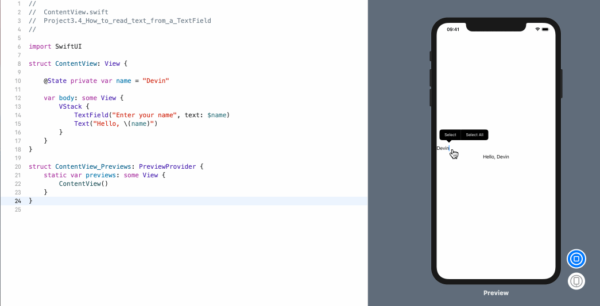

<!-- more -->
### 1. 简介
SwiftUI 的 `TextField` 视图类似于 UIkit 中的 `UITextField`，但是，在默认情况下 `TextField` 看起来有点不同，并且它非常依赖于 **状态绑定（binding to state）**。

### 2. 创建 TextField
那么，要创建一个 TextField，我们应该给在 _text field_ 传入一个 `placeholder`，再加上它应该绑定到的状态属性。

例如: 现在，我们要创建一个 **绑定到本地字符串的 TextField**，然后在其下面放置一个文本视图，在键入时显示 TextField 的输出:
```swift
struct ContentView: View {
    
    @State private var name = ""
    
    var body: some View {
        VStack {
            TextField("Enter your name", text: $name)
            Text("Hello, \(name)")
        }
    }
}
```
运行后，我们应该能够在 TextField 中输入文字，并在下面直接看到一条问候语。
运行效果:


使用 TextField 时有两个重要的限制条件:

首先，默认情况下，它没有边框，因此我们可能看不到任何内容 -- 我们需要大致点击其所在位置，以激活键盘。
其次，我们可能会发现无法在布局的画布预览中键入内容。如果遇到这个问题，请按 Cmd+R 在模拟器中构建和运行代码。