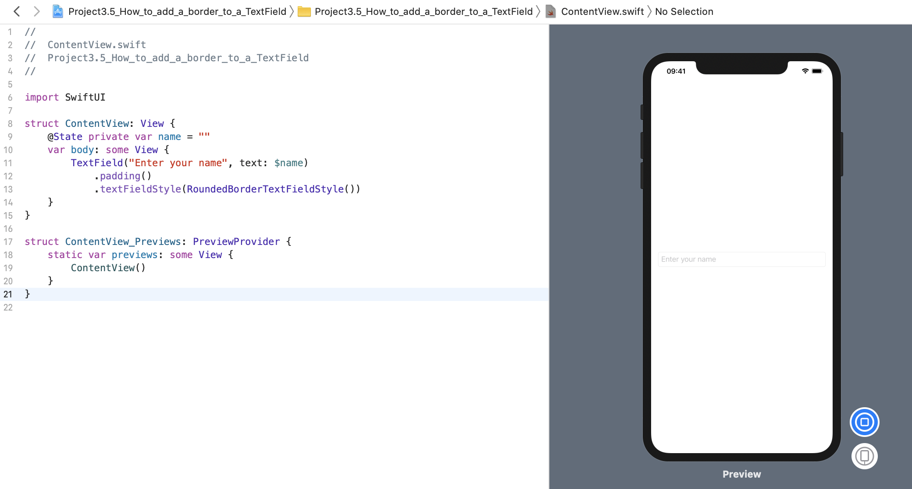

<!-- more -->
SwiftUI 的 `TextField` 视图默认没有样式，这意味着在屏幕上它是一个空白区域。如果这样就符合你想要的风格，那就太好了，你已经完成了。但是，我们大多时候更希望在 `TextField` 周围添加边框，以使其更清晰。

如果想获得我们习惯使用的 UITextField 的圆角矩形样式，我们应该使用 `.textFieldStyle(RoundedBorderTextFieldStyle())` 修饰符，如下所示:
```swift
struct ContentView: View {
    @State private var name = ""
    var body: some View {
        TextField("Enter your name", text: $name)
            .padding()
            .textFieldStyle(RoundedBorderTextFieldStyle())
    }
}
```
效果预览:


