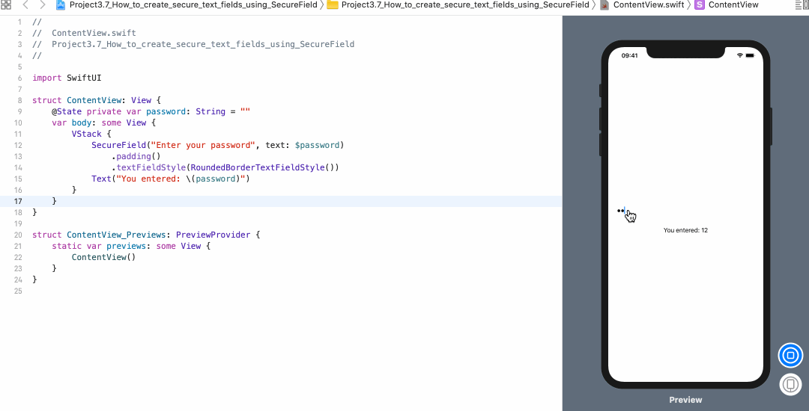

<!-- more -->
SwiftUI 的 `SecureField` 与常规的 `TextField` 的工作原理几乎相同，不同之处在于，出于保护隐私的目的而屏蔽了文本框中的字符。当然，将其绑定到的基础值仍然是一个纯字符串，因此我们可以根据需要进行检查。

这里有一个示例，创建了一个绑定到本地 `@State`  属性的 `SecureField`，以便我们可以显示键入文本框中的内容:
```swift
struct ContentView: View {
    @State private var password: String = ""
    var body: some View {
        VStack {
            SecureField("Enter your password", text: $password)
                .padding()
                .textFieldStyle(RoundedBorderTextFieldStyle())
            Text("You entered: \(password)")
        }
    }
}
```
效果预览:
