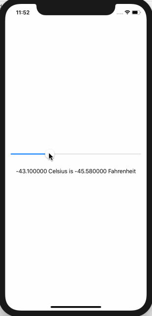

<!-- more -->
### 1. 简介
SwiftUI 的 `Slider` 视图的工作原理与 `UISlider` 非常相似，尽管您需要将其绑定到某个地方，以便存储其值。
当我们创建它时，可以提供多种参数，但我们可能最关心的是:

* `Value`:  要绑定到的值是多少
* `From and To`: 滑块的范围
* `By`: 移动滑块时要更改多少值

### 2. 示例
例如: 我们创建一个绑定到  Celsius 属性的滑块，然后在滑块移动时更新文本视图，以便在 **Celsius(摄氏温度)** 和 **Fahrenheit(华氏温度)** 之间进行转换:
```swift
struct ContentView : View {
    
    @State var celsius: Double = 0
    
    var body: some View {
        VStack {
            Slider(value: $celsius, from: -100, through: 100, by: 0.1)
                .padding()
            Text("\(celsius) Celsius is \(celsius * 9 / 5 + 32) Fahrenheit")
        }
    }
}
```
运行效果:
