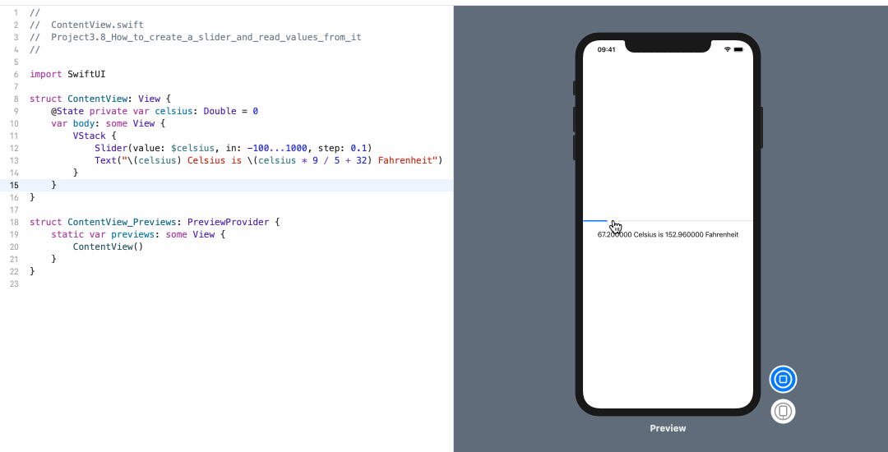

<!-- more -->
### 1. 简介
SwiftUI 中的 `Slider` 视图与 `UISlider` 的工作原理非常相似，不同之处在于，我们需要将其绑定到某个状态属性(@State)，以便存储其值。

当我们创建它时，可以提供多种参数，但我们最关心的可能是以下参数:

* `value`:  将其绑定到的 Double 值
* `in`: Slider 的范围
* `by`: 移动 Slider 时要更改多少值

### 2. 示例
例如: 我们将创建一个 Slider，并将其绑定到状态属性 `celsius`，然后随着 Slider 的移动更新文本视图，以便在 **Celsius(摄氏温度)** 和 **Fahrenheit(华氏温度)** 之间进行转换:
```swift
struct ContentView: View {
    @State private var celsius: Double = 0
    var body: some View {
        VStack {
            Slider(value: $celsius, in: -100...1000, step: 0.1)
            Text("\(celsius) Celsius is \(celsius * 9 / 5 + 32) Fahrenheit")
        }
    }
}
```
效果预览:
