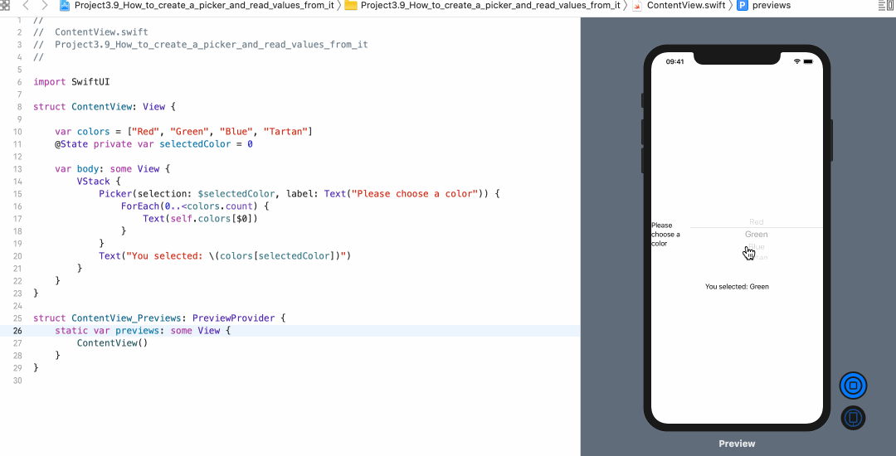

<!-- more -->
## 1. 简介
SwiftUI 中的 `Picker` 视图可以将 `UIPicker` 和 `UITableView` 结合在一起。同时还可以适应其它操作系统上的其它样式。很好的一点是，我们真的不需要关心它的工作原理 -- SwiftUI 在自动适应环境方面做得很好。

与大多数其它控件一样，我们必须将 Picker 附加到某种状态属性，以跟踪 picker 的选择。

## 2. 示例
例如: 我们将创建一个 colors 数组和一个存储所选颜色的整数，然后将其与 Picker，Text 视图一起使用，以便我们可以看到正在读取的值:
```swift
struct ContentView: View {
    
    var colors = ["Red", "Green", "Blue", "Tartan"]
    @State private var selectedColor = 0
    
    var body: some View {
        VStack {
            Picker(selection: $selectedColor, label: Text("Please choose a color")) {
                ForEach(0..<colors.count) {
                    Text(self.colors[$0])
                }
            }
            Text("You selected: \(colors[selectedColor])")
        }
    }
}
```
效果预览:


注意: 将 Picker 放在某个内容中非常重要，以确保它在iOS上以默认的轮子样式显示。