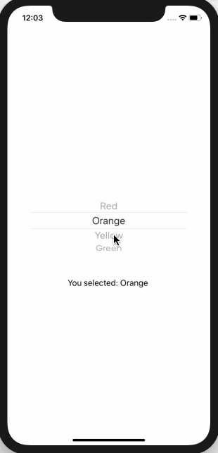

<!-- more -->
SwiftUI 的 `Picker` 视图将 UIPicker 和 UITableView 结合在一起。同时也适应其它操作系统上的其它样式。最棒的是我们真的不需要关系它是如何工作的 -- SwiftUI 可以很好的自动适应它的环境。
与大多数其它控件一样，必须将 picker 附加到某种 state，以跟踪 picker 的选择。例如: 这会创建一个 colors 数组和一个存储所选颜色的整数，然后将其与 picker，Text 视图一起使用，以便您可以看到正在读取的值:
```swift
struct ContentView: View {
    
    var colors = ["Red", "Orange", "Yellow", "Green"]
    @State private var selectedColor = 0
    
    var body: some View {
        VStack {
            Picker(selection: $selectedColor, label: Text("Please choose a color")) {
                ForEach(0..<colors.count) {
                    Text(self.colors[$0]).tag($0)
                }
            }
            Text("You selected: \(colors[selectedColor]) ")
        }
    }
}
```
运行效果:


注意: 将选择器视图放在某个内容中非常重要，以确保它在iOS上以默认的轮子样式显示。