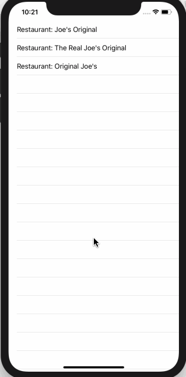

<!-- more -->
要创建静态项目列表，首先需要定义列表中每行的外观。 这是一个与其他视图一样的视图，因此您可以编写如下的视图:
```swift
struct RestaurantRow : View {
    
    var name: String
    
    var body: some View {
        Text("Restaurant: \(name)")
    }
}
```
既然已经定义了每一行的外观，那么就可以创建一个 `List`，根据需要创建任意数量的行，如下所示:
```swift
struct ContentView : View {
    var body: some View {
        List {
            RestaurantRow(name: "Joe's Original")
            RestaurantRow(name: "The Real Joe's Original")
            RestaurantRow(name: "Original Joe's")
        }
    }
}
```
运行效果:

当该代码运行时，您将在表中看到三行，就像您在 UIKit 中使用 `UITableView` 一样。
您不需要使每一行使用相同的视图类型，因此您可以根据需要混合和匹配行视图。