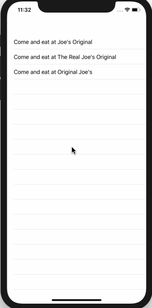

<!-- more -->
为了处理动态项目，我们必须首先告诉 SwiftUI 如何识别哪个项目是哪个。 这是使用 `Identifiable` 协议完成的，该协议只有一个要求: 某种类型的 id 值，SwiftUI 可以使用它来查看哪个项目是哪个。
例如，我们可以创建一个 `Restaurant` 结构体，该结构表示餐馆具有 ID 和 name ，ID 是一个随机标识符，以便 SwiftUI 知道哪个是哪个:
```swift
struct Restaurant: Identifiable {
    var id = UUID()
    var name: String
}
```
接下来，我们将定义列表行的外观。在我们的例子中，我们将定义一个 `Restaurantrow` 视图，该视图存储一个餐厅并在文本视图中打印其名称:
```swift
struct RestaurantRow : View {
    
    var restaurant: Restaurant
    
    var body: some View {
        Text("Come and eat at \(restaurant.name)")
    }
}
```
最后，我们可以创建一个列表视图来显示所有内容。这意味着创建一些示例数据，将其放入数组中，然后将其传递到要呈现的列表中:
```swift
struct ContentView : View {
    
    var body: some View {
        
        let first = Restaurant(name: "Joe's Original")
        let second = Restaurant(name: "The Real Joe's Original")
        let third = Restaurant(name: "Original Joe's")
        let restaurants = [first, second, third]
        
        return List(restaurants) { restaurant in
            RestaurantRow(restaurant: restaurant)
        }
    }
}
```
其中大部分只是创建数据——最后一部分是实际操作的地方:
```swift
return List(restaurants) { restaurant in
    RestaurantRow(restaurant: restaurant)
}
```
它从 restaurants 数组创建一个列表，对数组中的每个项目执行一次闭包。每次执行闭包时，餐厅的输入都将由数组中的一个项目填充，因此我们使用它来创建一个 Restaurantrow。
事实上，在这种小case下，我们可以使代码更短:
```swift
return List(restaurants, rowContent: RestaurantRow.init)
```
运行效果:
