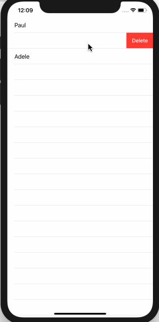

<!-- more -->

通过将 `OnDelete(perform:)` 处理程序附加到部分或全部数据，SwiftUI 可以方便地让用户滑动以删除行。此处理程序需要具有一个特定签名，它可以接受多个索引以删除，如:
```swift
func delete(at offsets: IndexSet) {
```
在这里，您可以循环访问集合中的每个索引，或者只读取第一个索引（如果您只想处理它的话）。因为SwiftUI 正在监视您的状态，所以您所做的任何更改都将自动反映在您的UI中。
注意：此功能的 WWDC 演示使用了一个名为 `remove(atOffsets:)` 的不存在的Swift数组方法，它为我们完成了所有这些工作 - 希望这将在未来版本中出现。
例如，此代码创建一个包含三个项目列表的 ContentView 结构，然后附加一个 `OnDelete(perform:)` 修饰符，用于删除列表中的任何项目:
```swift
struct ContentView: View {
    
    @State var users = ["Paul", "Taylor", "Adele"]
    
    var body: some View {
        List {
            ForEach(users, id: \.self) { user in
                Text(user)
            }
            .onDelete(perform: delete)
        }
    }
    
    func delete(at offsets: IndexSet) {
        if let first = offsets.first {
            users.remove(at: first)
        }
    }
}
```
运行效果:

如果您运行该代码，您会发现可以滑动以删除列表中的任何行。