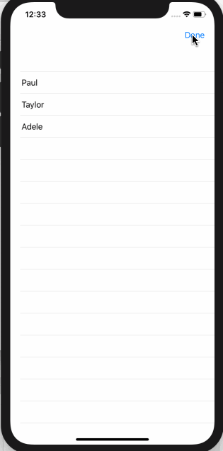

<!-- more -->
SwiftUI 为我们提供了简单地列表挂钩（hooks），让我们可以移动行(rows)，尽管 WWDC 上演示的一些功能在当前的测试版中实际上不可用，所以我们需要一个变通的解决方法。
我们可以将 `onMove(perform:)` 修饰符附加到列表中的项目，并让它在移动操作发生时调用我们选择的方法。 该方法需要接受 source IndexSet 和 destination Int，如下所示：
```swift
func move(from source: IndexSet, to destination: Int) {
```
移动多个项目时，最好先移动后一个项目，这样可以避免移动其他项目并混淆索引
例如，我们可以创建一个 ContentView 结构，它设置一个由三个用户名字符串组成的数组，并要求SwiftUI在调用 `move()`方法时移动它们。为了激活“移动”（即显示拖动手柄），它还向导航视图添加了一个编辑按钮，以便用户切换编辑模式。
这是代码:
```swift
struct ContentView : View {
    
    @State var users = ["Paul", "Taylor", "Adele"]
    
    var body: some View {
        NavigationView {
            List {
                ForEach(users, id: \.self, content: { user in
                    Text(user)
                })
                .onMove(perform: move)
            }
            .navigationBarItems(trailing: EditButton())
        }
    }
    
    func move(from source: IndexSet, to destination: Int) {
        // sort the indexes low to high
        let reverseSource = source.sorted()
        
        // then loop from the back to avoid reordering problems
        for index in reverseSource.reversed() {
            // for each item, remove it and insert it at the destination
            users.insert(users.remove(at: index), at: destination)
        }
    }
}
```
运行效果:

在WWDC会话演示中，他们的 `move()` 方法只是一行代码，因为它在 Swift 数组上使用了一个对我们不可用的扩展——希望它很快就会到来！