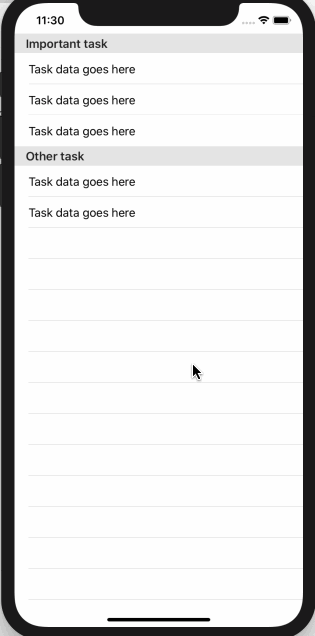

SwiftUI 的列表视图内置了对 _sections_ 和 _section headers_ 的支持，就像 UIKit 中的 `UITableView` 一样。若要给某些 cells 添加一个 _section_，首先在其周围放置一个 `Section`，也可以添加 _header_ 和 _footer_。
举个例子，这里有一行包含提醒应用的任务数据：
```swift
struct TaskRow: View {
    var body: some View {
        Text("Task data goes here")
    }
}
```
我们要做的是创建一个列表视图，它有两个Sections：一个用于重要任务，另一个用于次要任务。这是它的样子：
```swift
struct ContentView : View {
    var body: some View {
        List {
            Section(header: Text("Important task")) {
                TaskRow()
                TaskRow()
                TaskRow()
            }
            Section(header: Text("Other task")) {
                TaskRow()
                TaskRow()
            }
        }
    }
}
```
运行效果:
