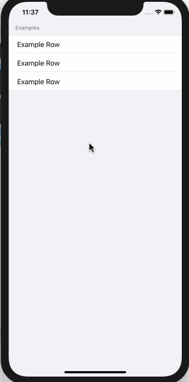

<!-- more -->
SwiftUI 的 List 支持 _grouped_ 或 _plain_ 样式，就像 `UITableView` 一样。默认为 _plain_ 样式，但如果要改为 _grouped_ 样式，则应使用 列表 的 `.listStyle(.grouped)` 修饰符。
例如，这里定义了一个示例行，并将其放置在分组列表中：
```swift
struct ExampleRow : View {
    var body: some View {
        Text("Example Row")
    }
}

struct ContentView : View {
    var body: some View {
        List {
            Section(header: Text("Examples")) {
                ExampleRow()
                ExampleRow()
                ExampleRow()
            }
        }.listStyle(.grouped)
    }
}
```
运行效果:
