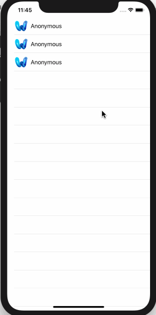

<!-- more -->

如果创建一个动态列表并在每行中放置多个内容，会发生什么情况？SwiftUI 的解决方案简单、灵活，并且在默认情况下为我们提供了良好的行为: 它创建了一个隐式的 `HStack` 来保存您的项目，因此它们会自动进行水平布局。
例如，如果我们想要创建一行，其中左侧有一张小图片，剩余的空间分配给一个文本字段，那么我们将从一个结构开始，这样保存数据:
```swift
struct User: Identifiable {
    var id = UUID()
    var username = "Anonymous"
}
```
我已经给出了这两个默认值，以便简化示例。
完成后，我们可以创建一个包含三个用户的数组，并在动态列表中显示它们，如下所示：
```swift
struct ContentView : View {
    let users = [User(), User(), User()]

    var body: some View {
        List(users) { user in
            Image("paul-hudson")
                .resizable()
                .frame(width: 40, height: 40)
            Text(user.username)
        }
    }
}
```
运行效果:
