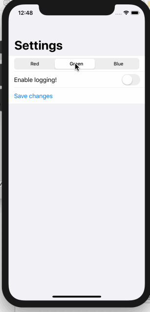

SwiftUI 中的 `表单(forms)` 可以当作容器使用，就像 `HStack` 和 `VStack` 一样，这意味着我们可以根据需要在其中添加其它视图。 但是，表单会自动调整某些控件的行为和样式，以便它们更好地适应表单环境。
例如，我们将创建一个带有 _toggle_、_segmentedControl_ 和 _button_ 的表单:
```swift
struct ContentView : View {
    
    @State var enableLogging = false
    @State var selectedColor = 0
    @State var colors = ["Red", "Green", "Blue"]
    
    var body: some View {
        NavigationView {
            Form {
                Picker(selection: $selectedColor, label: Text("")) {
                    ForEach(0..<colors.count) {
                        Text(self.colors[$0]).tag($0)
                    }
                }
                .pickerStyle(SegmentedPickerStyle())
                
                Toggle(isOn: $enableLogging) {
                    Text("Enable logging!")
                }
                Button(action: {
                    // activate theme!
                }) {
                    Text("Save changes")
                }
            }
            .navigationBarTitle(Text("Settings"))
        }
    }
}
```
运行效果:

当代码运行时，我们将看到两件对表单行为至关重要的事情:

* 在 iOS 上，表单自动采用 `分组列表` 的样式，因此用户可以看到滚动选项。
* 按钮已经调整了自己，看起来像一个可操作的列表行—— `左对齐，蓝色`。

> 注意: 我们可以根据需要在表单中包含尽可能多的行，但如果需要超过10，请记住使用组(groups)。