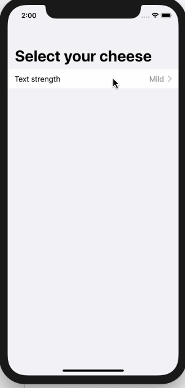
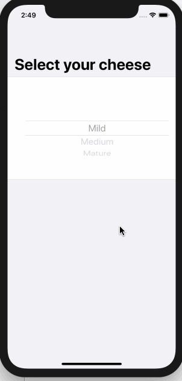

<!-- more -->
在表单内部，SwiftUI 的 `选择器视图` 具有特殊的行为，可根据我们使用它们的平台自动进行调整。在 iOS 上，这种行为尤其令人印象深刻，因为选择器可以折叠到一个列表行，该行导航到一个新的可能选项列表中——这是处理许多选项的一种非常自然的方式。

例如，这将创建一个带有选择器的表单，并为其项使用数组：
```swift
struct ContentView : View {
    
    var strengths = ["Mild", "Medium", "Mature"]
    @State var selectedStrength = 0
    
    var body: some View {
        NavigationView {
            Form {
                Section {
                    Picker(selection: $selectedStrength, label: Text("Text strength")) {
                        ForEach(0..<strengths.count) {
                            Text(self.strengths[$0]).tag($0)
                        }
                    }
                }
            }
            .navigationBarTitle(Text("Select your cheese"))
        }
    }
}
```
运行效果:

表单中的选择器
在 iOS 上，这将显示为一个单独的列表行，您可以点击该行进入一个新屏幕，显示所有可能的选项—— Mild、Medium 和 Mature。您当前的选择旁边将有一个复选标记，当您选择一个新选项时，它将返回上一个屏幕，并显示当前的选项。


如果要禁用此行为，可以使用.PickerStyle(.wheel)修饰符强制选取器采用其常规样式，如下所示：
```swift
Picker(selection: $selectedStrength, label: Text("Text strength")) {
    ForEach(0..<strengths.count) {
        Text(self.strengths[$0]).tag($0)
    }
}
.pickerStyle(WheelPickerStyle())
```
运行效果:
