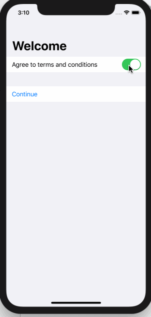

<!-- more -->
SwiftUI 允许我们通过使用 `disabled()` 修饰符来禁用表单的任何部分甚至整个表单。这需要一个布尔值来定义是否应禁止使用该元素。表单元素的样式会自动更新以反映其状态-例如，_buttons_ 和  _toggles_ 变为灰色。

例如，这将创建一个包含两个 sections 的表单：一个section 包含 Toggle ，另一个部分包含仅在切换打开时才启用的 Button：
```swift
struct ContentView : View {
    
    @State var agreedToTerms = false
    
    var body: some View {
        NavigationView {
            Form {
                Section {
                    Toggle(isOn: $agreedToTerms) {
                        Text("Agree to terms and conditions")
                    }
                }
                Section {
                    Button(action: {
                        // show next screen here
                    }) {
                        Text("Continue")
                    }
                    .disabled(!agreedToTerms)
                }
            }
            .navigationBarTitle(Text("Welcome"))
        }
    }
}
```
运行效果:

如您所见，只需将禁用（!agreeToTerms）添加到修改器列表中即可禁用该按钮。

与许多其他SwiftIUI修饰符一样，您可以提升 `disabled()`，以便它在 Section 上运行，甚至在整个表单上运行，这取决于您想要的行为——例如，只需移动 `disabled(!agreedToTerms)` 使它位于该 section 之后:
```swift
Section {
    Button(action: {
        // show next screen here
    }) {
        Text("Continue")
    }
}
.disabled(!agreedToTerms)
```