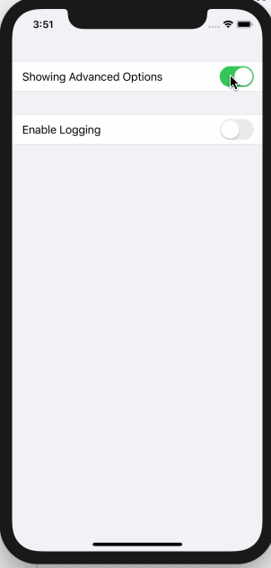

<!-- more -->
SwiftUI 允许我们可以根据需要在表单中添加和删除项目，当我们希望调整基于先前选项可见的选项列表时，特别有用。

例如，这会显示单个 _toggle_ ，提示用户是否要显示更多高级选项。启用该 _toggle_ 后，会出现第二个 _toggle_ ，允许他们启用日志记录:
```swift
struct ContentView : View {
    
    @State var showingAdvancedOptions = false
    @State var enableLogging = false
    
    var body: some View {
        Form {
            Section {
                Toggle(isOn: $showingAdvancedOptions) {
                    Text("Show advanced options")
                }
                
                if showingAdvancedOptions {
                    Toggle(isOn: $enableLogging) {
                        Text("Enable logging")
                    }
                }
            }
        }
    }
}
```
运行效果:

与其他绑定一样，可以要求 SwiftUI 对绑定更改导致的视图更改使用隐式动画，如下所示:
```swift
struct ContentView: View {
    
    @State var showingAdvancedOptions = false
    @State var enableLogging = false
    
    var body: some View {
        Form {
            Section {
                Toggle(isOn: $showingAdvancedOptions.animation()) {
                    Text("Showing Advanced Options")
                }
            }
            
            if showingAdvancedOptions {
                Toggle(isOn: $enableLogging) {
                    Text("Enable Logging")
                }
            }
        }
    }
}
```
运行效果:

