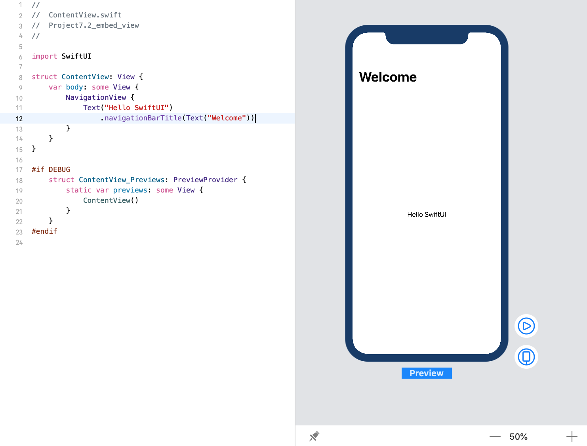

<!-- more -->
SwiftUI 中的 `NavigationView` 几乎等同于 UIKit 中的 `UINavigationController`，因为它不仅可以呈现内容，而且它能够处理视图之间的导航，并在屏幕顶部放置一个导航栏。

接下来，我们以最简单的形式，将文本视图放入导航视图中，如下所示:
```swift
struct ContentView: View {
    var body: some View {
        NavigationView {
            Text("Hello SwiftUI")
        }
    }
}
```
效果预览:

但是这样，顶部的导航栏为空。因此，通常在嵌入的内容上使用 `navigationBarTitle()` 修饰符，因此，我们可以在屏幕顶部添加标题，如下所示:
```swift
struct ContentView: View {
    var body: some View {
        NavigationView {
            Text("Hello SwiftUI")
                .navigationBarTitle("Welcome")
        }
    }
}
```
效果预览:
