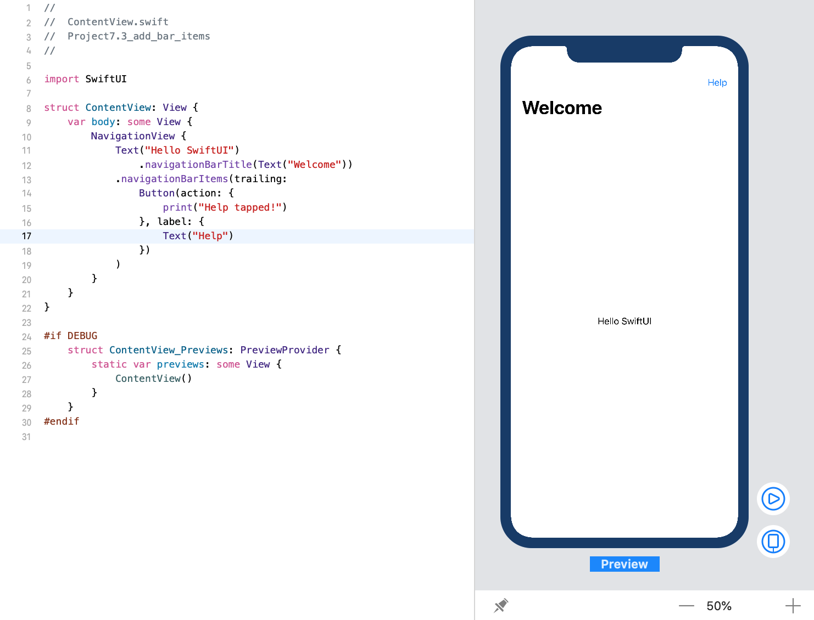

<!-- more -->
通过 `navigationBarItems()` 修饰符，我们可以在导航视图的 _前缘(leading)_ 和 _后缘(trailing)_  添加 **bar items**。这些 **bar items** 可能是一个可点击的按钮，但没有任何限制 - 您可以添加任何类型的视图。

例如: 我们可以在导航视图的后缘(trailing)添加一个 **帮助按钮**:
```swift
struct ContentView: View {
    var body: some View {
        NavigationView {
            Text("Hello SwiftUI")
                .navigationBarTitle(Text("Welcome"))
            .navigationBarItems(trailing:
                Button(action: {
                    print("Help tapped!")
                }, label: {
                    Text("Help")
                })
            )
        }
    }
}
```
效果预览:
