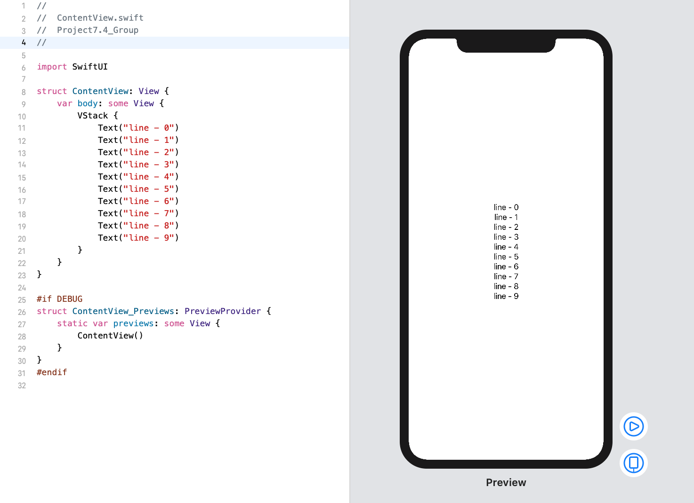

<!-- more -->
如果我们需要将多个视图作为一个视图，例如: 一起转换。那么，我们应该使用 SwiftUI 的 `Group` 视图。这一点尤为重要，因为出于底层的技术原因，我们一次性最多只能向父视图添加十个子视图。
```swift
struct ContentView: View {
    var body: some View {
        VStack {
            Text("line - 0")
            Text("line - 1")
            Text("line - 2")
            Text("line - 3")
            Text("line - 4")
            Text("line - 5")
            Text("line - 6")
            Text("line - 7")
            Text("line - 8")
            Text("line - 9")
        }
    }
}
```
效果预览:

一切正常，但是，当我们尝试添加第11行文本的时候，就会报错:
```swift
Ambiguous reference to member 'buildBlock'
```
错误预览:

后面是一串这样的错误信息:
```swift
ContentView.swift:10:16: Found this candidate (SwiftUI.ViewBuilder)
```
这是因为 SwiftUI 的视图构建系统中有各种各样的代码设计，可以让我们添加1个视图、2个视图、2个视图、3个视图、4个视图、5个视图、6个视图、7个视图、8个视图、9个视图和10个视图，但是不适用于11个或更多视图 - 这不起作用。

幸运的是，我们可以像这样使用 `group`:
```swift
struct ContentView: View {
    var body: some View {
        VStack {
            Group {
                Text("line - 0")
                Text("line - 1")
                Text("line - 2")
                Text("line - 3")
                Text("line - 4")
                Text("line - 5")
            }
            Group {
                Text("line - 6")
                Text("line - 7")
                Text("line - 8")
                Text("line - 9")
                Text("line - 10")
            }
        }
    }
}
```
效果预览:

这产生了完全相同的结果，现在我们可以超过10个视图的限制，因为 `VStack` 中只包含两个视图——两个组。