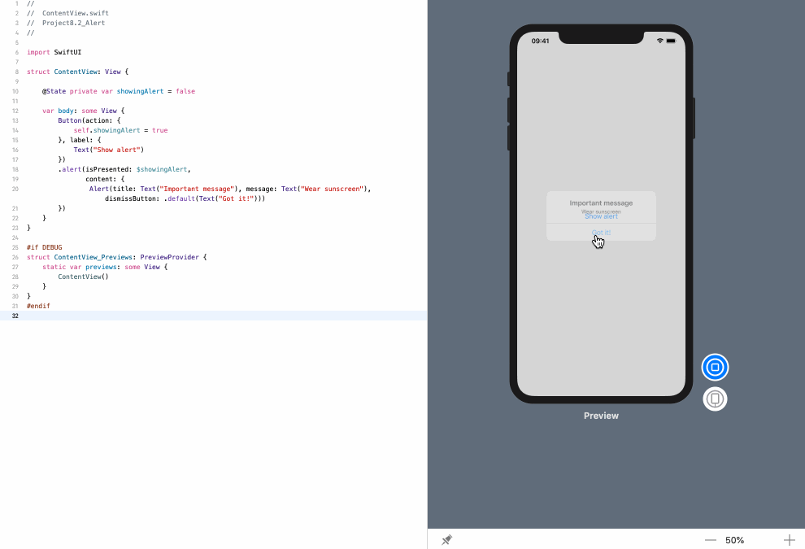

<!-- more -->
创建一个基本的 SwiftUI alert 的代码如下:
```swift
Alert(title: Text("Important message"), message: Text("Wear sunscreen"), dismissButton: .default(Text("Got it!")))
```
它定义了一个标题和消息，就像我们在 `UIAlertController` 中看到的那样，然后添加了一个带有默认样式的 dismiss 按钮和文本 "Got it!"。

要显示该 alert，我们需要定义某种可绑定条件，以确定 alert 是否可见。然后将其作为演示附加到主视图中，在 alert 条件变为 true 的时候，立即显示 alert。

例如: 下面的代码创建一个 `showingAlert` 的布尔值，用于跟踪是否应该显示 "sunscreen message"，在点击按钮时将该布尔值设置为 true，然后使用该布尔值创建并附加一个 alert 视图，以便在点击按钮时显示:
```swift
struct ContentView: View {
    
    @State private var showingAlert = false
    
    var body: some View {
        Button(action: {
            self.showingAlert = true
        }, label: {
            Text("Show alert")
        })
        .alert(isPresented: $showingAlert,
               content: {
                Alert(title: Text("Important message"), message: Text("Wear sunscreen"), dismissButton: .default(Text("Got it!")))
        })
    }
}
```
效果演示:


> **提示:** 通过这种方式展示一个 alert，当按下关闭按钮时，会自动将 `showingAlert` 设置回 false。