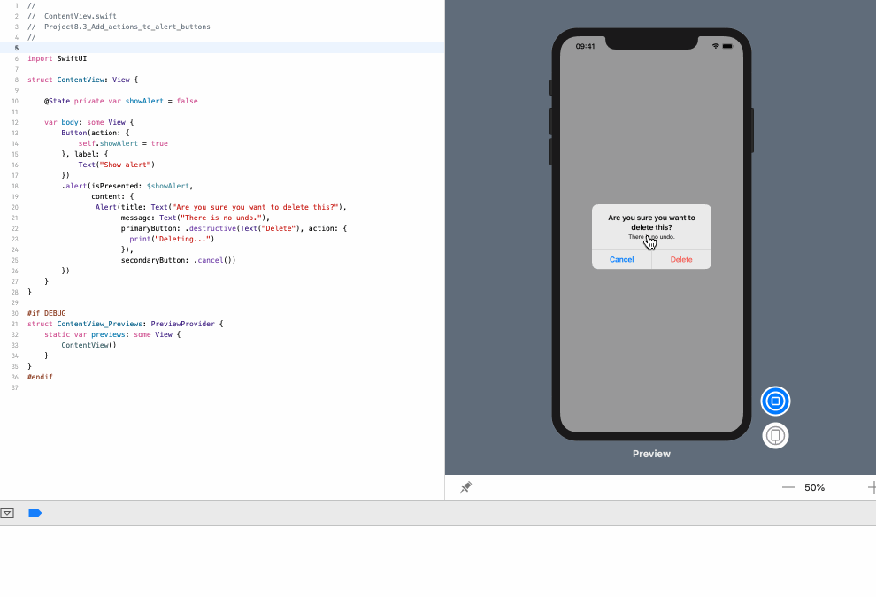

<!-- more -->
基本的 SwiftUI alert 如下所示:
```swift
Alert(title: Text("Important message"), message: Text("Wear sunscreen"), dismissButton: .default(Text("Got it!")))
```

但是，我们经常需要将操作附加到按钮上，以便在点击按钮时执行特定操作。要做到这一点，请在按钮上附加一个闭包，当按钮被点击时闭包将被调用，如下所示:
```swift
struct ContentView: View {
    
    @State private var showAlert = false
    
    var body: some View {
        Button(action: {
            self.showAlert = true
        }, label: {
            Text("Show alert")
        })
        .alert(isPresented: $showAlert,
               content: {
                Alert(title: Text("Are you sure you want to delete this?"),
                      message: Text("There is no undo."),
                      primaryButton: .destructive(Text("Delete"), action: {
                        print("Deleting...")
                      }),
                      secondaryButton: .cancel())
        })
    }
}
```
效果预览:


> 提示: 在预览视图中，点击 `Delete` 按钮，控制台没有日志输出。