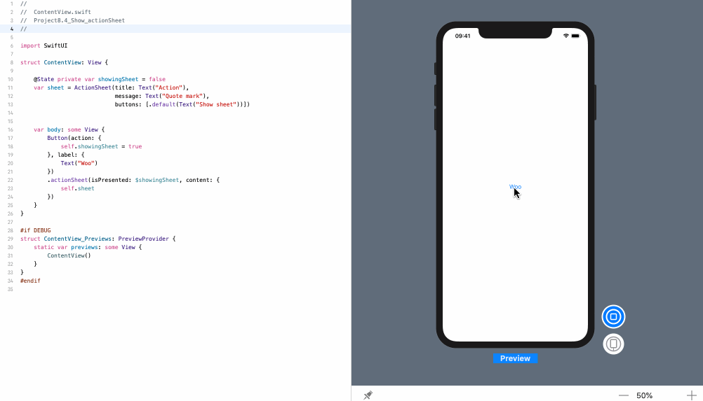

<!-- more -->
SwiftUI 为我们提供了 `ActionSheet` 视图，用于创建供用户选择的操作表。但是，我们确实需要确保在它被解除时重置我们的状态，否则，我们将无法再次显示它。

稍后，我们再展示所有代码，现在我们首先将其分解，因为这并不容易。

首先，我们需要定义一个属性来跟踪是否需要显示操作表:
```swift
@State private var showingSheet = false
```

接下来，我们应该创建一个属性来存储操作表。这需要标题和消息文本，但也应该提供一个按钮数组。如下所示:
```swift
var sheet = ActionSheet(title: Text("Action"),
                        message: Text("Quote mark"),
                        buttons: [.default(Text("Show sheet"))])
```
完成后，我们可以使用显示工作表的演示文稿将操作表附加到视图中，或者根据showsSheet的值执行任何操作，如下所示:
```swift
struct ContentView: View {
    
    @State private var showingSheet = false
    var sheet = ActionSheet(title: Text("Action"),
                            message: Text("Quote mark"),
                            buttons: [.default(Text("Show sheet"))])
        
        
    var body: some View {
        Button(action: {
            self.showingSheet = true
        }, label: {
            Text("Woo")
        })
        .actionSheet(isPresented: $showingSheet, content: {
            self.sheet
        })
    }
}
```
效果预览:
