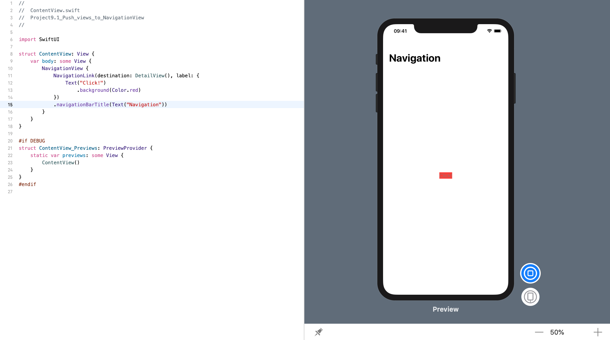

<!-- more -->
如果我们有一个导航视图，并且希望将一个新视图 push 到 SwiftUI 的导航堆栈上，那么我们应该使用 `NavigationLink`，在 beta 1和2 中使用的是 `NavigationButton`。这将一个目标作为它的第一个参数，以及在按钮内部显示什么作为它的第二个参数（或者作为一个尾随闭包），并负责将新视图和动画一起 push 到堆栈上。

例如: 如果我们有这样一个 **详细视图**:
```swift
struct DetailView: View {
    var body: some View {
        Text("Detail")
    }
}
```
然后我们可以这样呈现它:
```swift
struct ContentView: View {
    var body: some View {
        NavigationView {
            NavigationLink(destination: DetailView(), label: {
                Text("Click!")
                    .background(Color.red)
            })
            .navigationBarTitle(Text("Navigation"))
        }
    }
}
```
效果预览:
