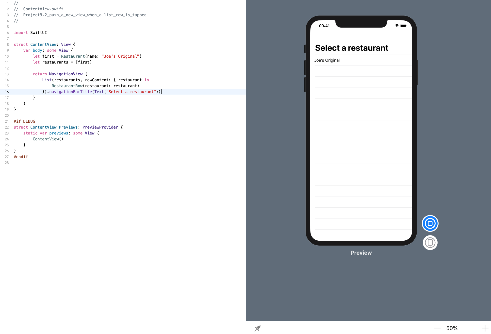
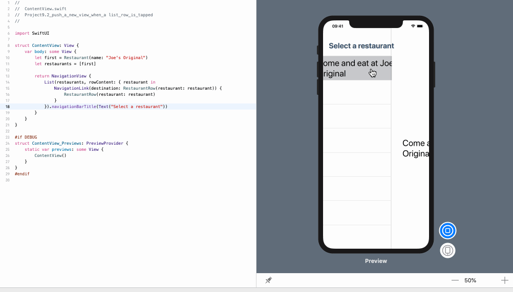

 <!-- more -->

 SwiftUI 中没有 `UITableView` 的 `didSelectRowAt` 方法的直接等价物，但它不需要这样的方法，因为我们可以将 `NavigationLink` 与列表行结合起来并免费获取这种 behavior。

我们需要将列表与我们可以使用的一些内容放在一起。 首先，我们需要某种数据来显示:
```swift
struct Restaurant: Identifiable {
    var id = UUID()
    var name: String
}
```
我们需要一个列表行视图，一次显示一个餐厅:
```swift
struct RestaurantRow: View {
    
    var restaurant: Restaurant
    
    var body: some View {
        Text(restaurant.name)
    }
}
```
最后，我们需要一个视图，其中包含可用餐厅的列表:
```swift
struct ContentView: View {
    var body: some View {
        let first = Restaurant(name: "Joe's Original")
        let restaurants = [first]
        
        return NavigationView {
            List(restaurants, rowContent: { restaurant in
                RestaurantRow(restaurant: restaurant)
            }).navigationBarTitle(Text("Select a restaurant"))
        }
    }
}
```
效果预览:

这段代码在列表中显示一家餐馆，但是不可选。

为了使点击一行显示详细视图，我们首先需要一个可以显示餐厅的详细视图。 例如，像这样:
```swift
struct RestaurantRow: View {
    
    var restaurant: Restaurant
    
    var body: some View {
        Text("Come and eat at \(restaurant.name)")
            .font(.largeTitle)
    }
}
```
有了它，我们现在可以在 `NavigationLink` 中包装 `RestaurantRow` 行，如下所示:
```swift
struct ContentView: View {
    var body: some View {
        let first = Restaurant(name: "Joe's Original")
        let restaurants = [first]
        
        return NavigationView {
            List(restaurants, rowContent: { restaurant in
                NavigationLink(destination: RestaurantRow(restaurant: restaurant)) {
                    RestaurantRow(restaurant: restaurant)
                }
            }).navigationBarTitle(Text("Select a restaurant"))
        }
    }
}
```
效果预览:

如您所见，使用 `RestaurantRow(restaurant: restaurant)` 作为行点击事件的目的地，因此将创建 `RestaurantView` 并传递附加到列表行的餐厅。

请注意，我们是如何在导航按钮中添加列表行的 — SwiftUI 凭借其出色的构图能力使其工作正常。